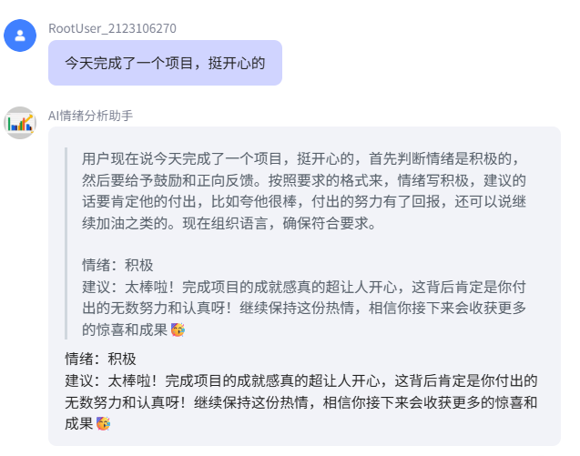
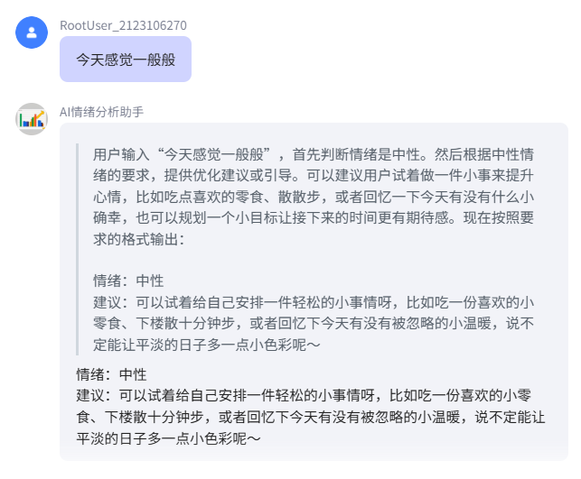
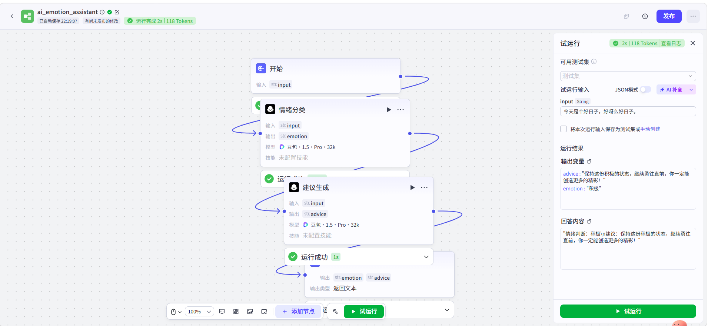
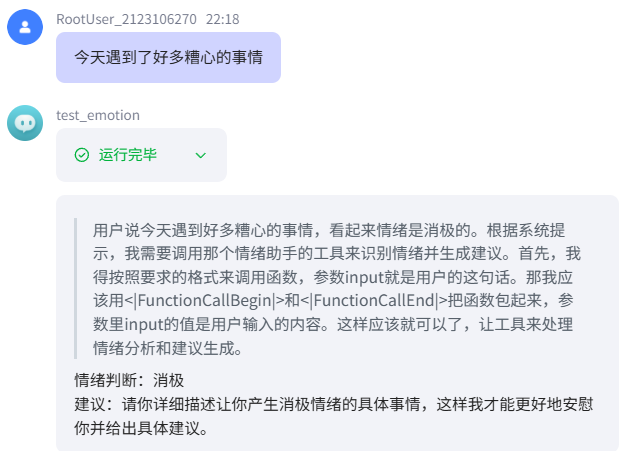

# AI情绪分析与建议系统（Coze实现）

## 📌 项目简介
本项目基于Coze平台开发，实现了一个具备基础“决策流程”的AI系统。

系统能够先判断用户情绪，再根据不同情绪给出针对性建议。

## 🚀 核心功能
- 自动识别用户情绪（积极 / 中性 / 消极）
- 根据情绪生成不同类型建议
- 模拟简单AI决策流程（分析 → 决策 → 输出）

## 🧠 技术原理
本项目体现了基础AI Workflow思想：

用户输入 → 情绪分类 → 策略选择 → 建议生成 → 输出结果

## 🛠 技术栈
- Coze
- Prompt Engineering
- Workflow思维（多步骤任务拆解）

## 📷 项目演示

### 消极情绪识别

### 中性情绪识别

### 积极情绪识别

## 🔄 工作流结构

## 📷 输出效果

## 💡 项目收获
- 理解AI系统如何拆解为多个步骤
- 掌握基础“决策型AI”设计思路
- 从单轮对话升级为流程型应用
